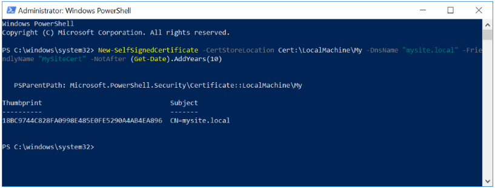
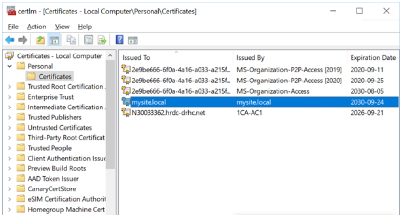

McAfee scans contents of code and triggers when it gets nervous about certain behaviours (like playing in registry or invoking other programs, etc). It can block in-house programs as well as off the shelf software. The simplest solution is to recognize the source as being trusted. For instance, if Adobe issues a piece of software, McAfee will trust it because we trust their reputation (even if some of the code is suspicious).

The recommended solution is to issue "Code Signing" certificates to programmers. In McAfee Threat Intelligence Exchange (TIE), a trusted reputation could be given to the provenance (Certificate Issuer) and we would automatically trust all the programmers. This is the clean and maintainable solution. If a programmer sold his ESDC certificate on the Dark Web and we found out about, the Certificate could be revoked by the CA or could be assigned a non-trust to that particular certificate in TIE.

## Instructions to create self-signed certificates

1. Open a PowerShell window as an **Administrator**, and enter the following command: 

   `New-SelfSignedCertificate -CertStoreLocation Cert:\LocalMachine\My -DnsName "mysite.local" -FriendlyName "MySiteCert" -NotAfter (Get-Date).AddYears(10)`

   This will create a self-signed certificate specific for mysite.local that is valid for 10 years. You can modify the number of years by changing the value in the AddYears function.
   
   
   
2. Once the certificate is created, you should copy it to the Trusted Root Certification Authorities store. 

3. Using Cortana search in Windows 10, type "certificate" until you see the "Manage computer certificates" option and open it as an Administrator. 

4. In the left panel, navigate to Certificates - Local Computer → Personal → Certificates 
   
   
	   
5. Locate the created certificate (in this example look under the Issued To column "mysite.local", or under the Friendly Name column "MySiteCert").
   
6. In the left panel, open (but don't navigate to) Certificates - Local Computer → Trusted Root Certification Authorities → Certificates 
   
7. With the right mouse button, drag and drop the certificate to the location opened in the previous step.
   
8. Select "Copy Here" in the popup menu.

## Export a certificate

To export the certificate in the local store to a Personal Information Exchange (PFX) file, use the Export-PfxCertificate cmdlet. 

When using **Export-PfxCertificate**, you must either create and use a password or use the "-ProtectTo" parameter to specify which users or groups can access the file without a password. Note that an error will be displayed if you don't use either the "-Password" or "-ProtectTo" parameter.

### Password Usage

   `$password = ConvertTo-SecureString -String <Your Password> -Force -AsPlainText`

   `Export-PfxCertificate -cert "Cert:\CurrentUser\My\<Certificate Thumbprint>" -FilePath <FilePath>.pfx -Password $password`

### ProtectTo Usage
   
   `Export-PfxCertificate -cert Cert:\CurrentUser\My\<Certificate Thumbprint> -FilePath <FilePath>.pfx -ProtectTo <Username or group name>`
   
   After you create and export your certificate, you're ready to sign your app package with **SignTool**. For the next step in the manual packaging process, see [Sign an app package using SignTool](https://docs.microsoft.com/en-us/windows/msix/package/sign-app-package-using-signtool). 
   
> Reference: https://docs.microsoft.com/en-us/windows/msix/package/create-certificate-package-signing
   